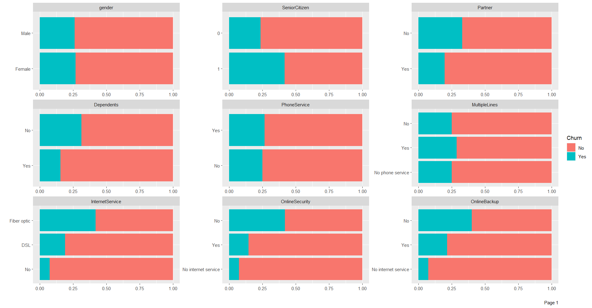
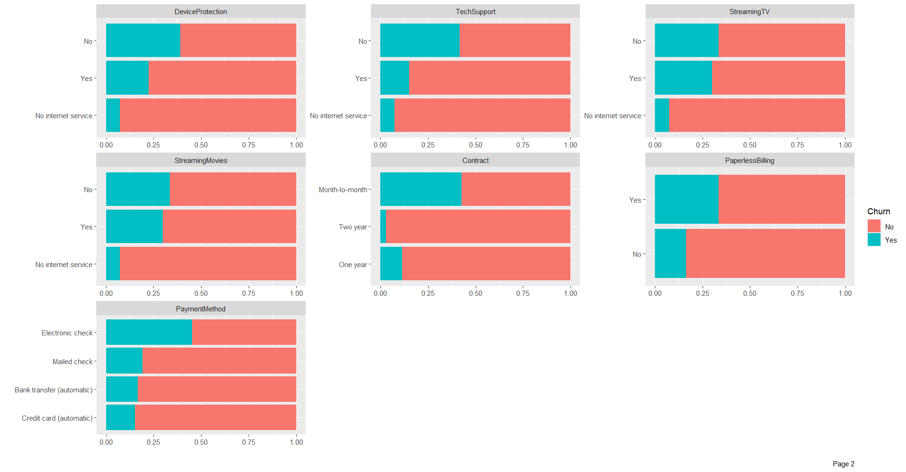
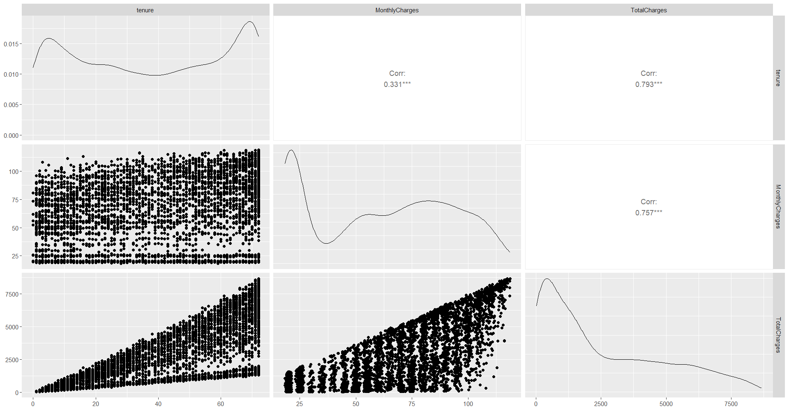
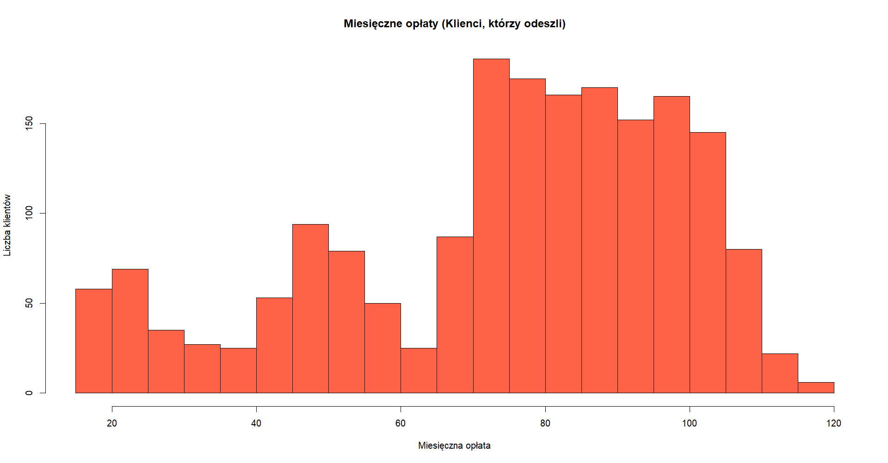
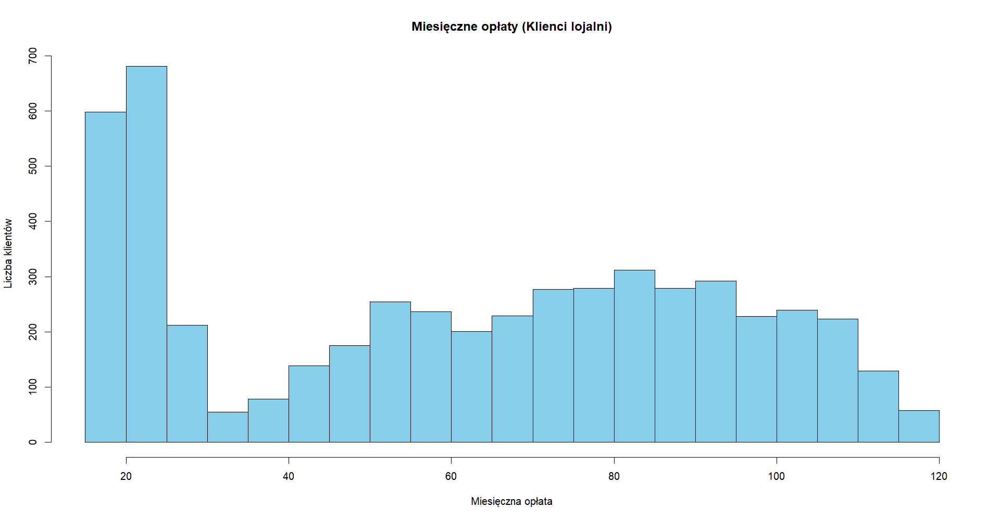

# Analiza Eksploracyjna (EDA): Churn Klientów Telekomunikacyjnych

Jest to projekt akademicki z przedmiotu "Eksploracja Danych", którego celem jest dogłębna analiza zbioru danych `Telco Customer Churn`. Głównym celem analizy jest zrozumienie struktury danych, zidentyfikowanie kluczowych cech klientów oraz znalezienie czynników, które najsilniej wpływają na ich rezygnację z usług (churn).

Cała analiza została przeprowadzona w środowisku R.

## 🛠️ Użyte Technologie

* **Język:** R
* **Kluczowe biblioteki:**
    * `ggplot2` i `DataExplorer` (do generowania wizualizacji)
    * `GGally` (do tworzenia macierzy wykresów rozrzutu)
    * `dplyr` (lub jego odpowiedniki, jak `subset`) (do manipulacji danymi)
    * `knitr` i `xtable` (użyte w oryginalnym raporcie do generowania tabel LaTeX)

## 🎯 Cel Projektu

Projekt miał na celu przeprowadzenie pełnej analizy eksploracyjnej (EDA) w celu:
1.  Zbadania ogólnej charakterystyki klientów firmy telekomunikacyjnej.
2.  Znalezienia zależności i korelacji między zmiennymi numerycznymi (np. `tenure`, `MonthlyCharges`).
3.  Zbadania rozkładu zmiennych kategorycznych (np. typy kontraktów, dodatkowe usługi).
4.  Zidentyfikowania, które cechy i usługi **najmocniej różnicują klientów lojalnych od tych, którzy rezygnują z usług**.

## 📈 Przeprowadzona Analiza

Analiza została podzielona na trzy główne etapy:

1.  **Przygotowanie Danych:** Wczytanie zbioru, inspekcja typów danych, konwersja zmiennej `SeniorCitizen` na typ `factor`, usunięcie niepotrzebnej kolumny `customerID` oraz weryfikacja brakujących wartości.
2.  **Analiza Ogólna:** Obliczenie statystyk opisowych dla całej populacji klientów (przy użyciu własnej funkcji `my.summary`). Wizualizacja rozkładów za pomocą histogramów, wykresów pudełkowych i słupkowych. Analiza korelacji między zmiennymi numerycznymi.
3.  **Analiza Porównawcza (Churn vs. Brak Churnu):** Podział zbioru danych na dwie grupy (`Churn == "Yes"` i `Churn == "No"`). Ponowne wykonanie pełnej analizy statystycznej i wizualizacyjnej dla obu grup osobno. Identyfikacja zmiennych, które wykazują największe zróżnicowanie między grupami.

## 💡 Kluczowe Wnioski

Analiza porównawcza pozwoliła na wyciągnięcie kilku kluczowych wniosków biznesowych:

* **Rodzaj umowy jest kluczowy:** Klienci z umowami długoterminowymi (rocznymi lub dwuletnimi) znacznie rzadziej rezygnują z usług niż klienci z umowami typu "Month-to-month".
* **Usługi dodatkowe zatrzymują klientów:** Klienci, którzy nie rezygnują, znacznie częściej korzystają z dodatkowych usług, takich jak `OnlineBackup`, `OnlineSecurity`, `DeviceProtection` czy `TechSupport`. Klienci, którzy odeszli, w większości nie posiadali tych usług.
* **Typ Internetu ma znaczenie:** Wśród klientów, którzy odeszli, dominował internet światłowodowy (`Fiber optic`). W grupie lojalnych klientów odsetek korzystających z `DSL` był proporcjonalnie wyższy.
* **Korelacje:** Potwierdzono bardzo silną korelację dodatnią między stażem klienta (`tenure`) a jego łącznymi opłatami (`TotalCharges`) (wsp. korelacji `0.826`). Zależność między stażem a opłatami miesięcznymi (`MonthlyCharges`) jest bardzo słaba (wsp. korelacji `0.248`).

## 📊 Przykładowe Wizualizacje

> **TWOJA AKCJA:** Uruchom skrypt `analiza.R` i zapisz poniższe wykresy jako pliki `.png`, a następnie umieść je tutaj.

### Porównanie Zmiennych Kategorycznych (Churn vs. Brak Churnu)

Najważniejsza wizualizacja z projektu, która pokazuje, które zmienne najmocniej różnicują obie grupy. Widać wyraźne różnice w rozkładzie dla zmiennych `Contract`, `OnlineSecurity` czy `InternetService`.




### Macierz Korelacji i Rozkładów Zmiennych Numerycznych

Wykres `ggpairs` pokazuje korelacje oraz gęstości rozkładów dla głównych zmiennych numerycznych.



### Rozkład Miesięcznych Opłat (Churn vs. Brak Churnu)

Wykresy pokazują, że klienci, którzy odeszli (`Churn == "Yes"`), częściej mieli wyższe opłaty miesięczne. Rozkład dla klientów lojalnych (`Churn == "No"`) ma wyraźny pik przy niższych opłatach.




## 🚀 Jak Uruchomić Ten Projekt

1.  Sklonuj repozytorium:
    ```bash
    git clone https://github.com/romansidaruk/telco-customer-churn-analysis-R.git
    ```
2.  Upewnij się, że masz plik `WA_Fn-UseC_-Telco-Customer-Churn.csv` w tym samym folderze.
3.  Zainstaluj wymagane biblioteki R:
    ```r
    install.packages(c("ggplot2", "DataExplorer", "GGally", "knitr", "xtable", "grid", "binom", "latex2exp", "vctrs", "vcd", "ca", "Exact", "exact2x2", "stats", "e1071", "kableExtra", "wooldridge"))
    ```
4.  Otwórz plik `analiza.R` w RStudio (lub innym środowisku R) i uruchom skrypt.
